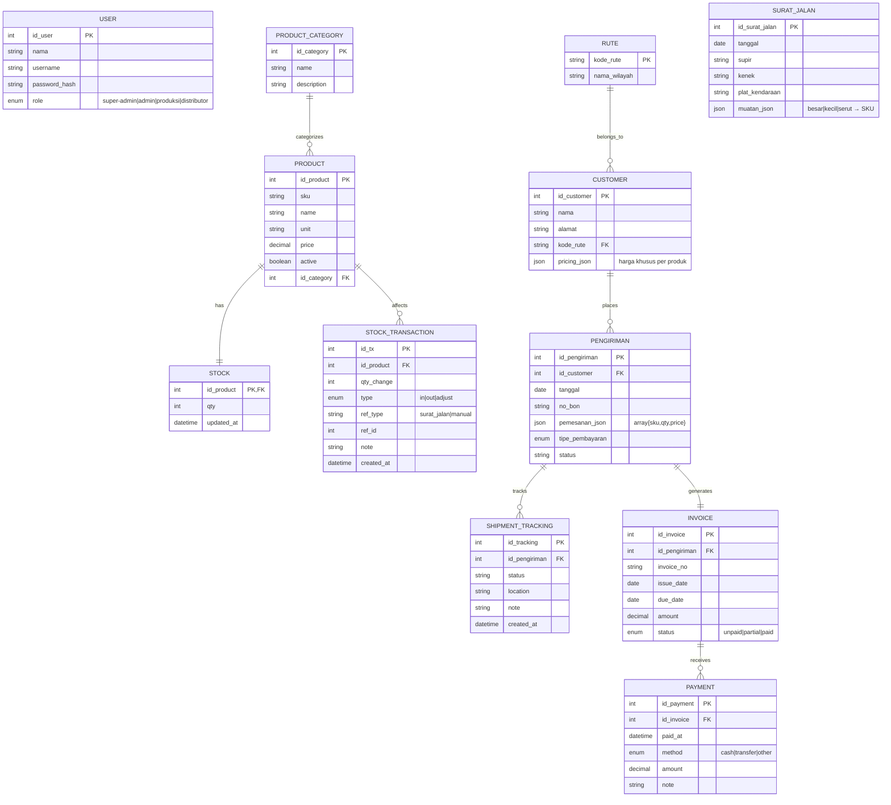
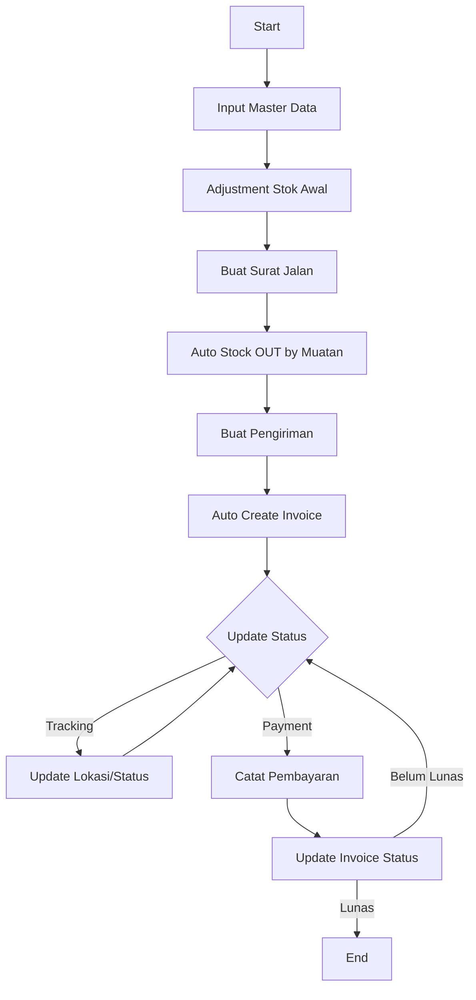
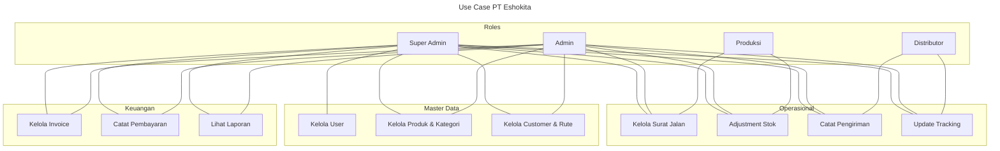
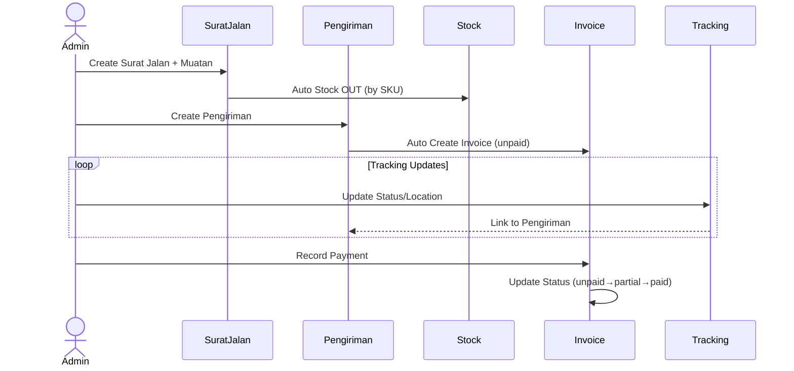
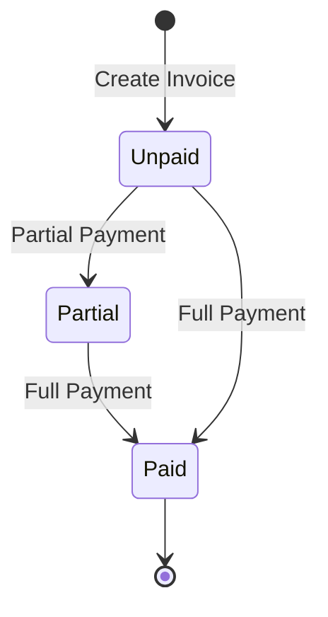
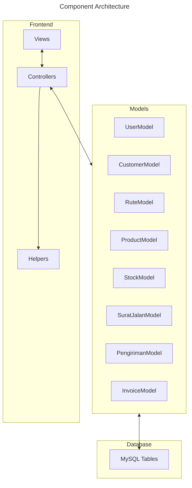

# Diagram Arsitektur PT Eshokita

## Entity Relationship Diagram (ERD)

## Flowchart Proses Utama

## Usecase Diagram

## Sequence Diagram: Proses Pengiriman

## State Diagram: Status Invoice

## Component Diagram

